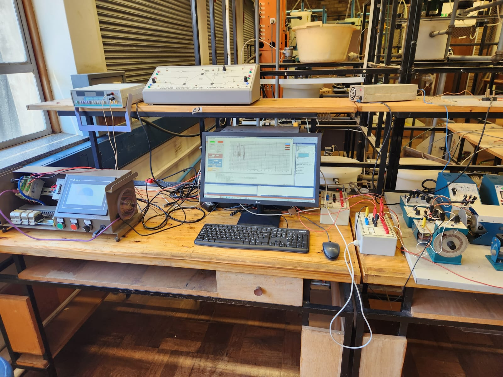
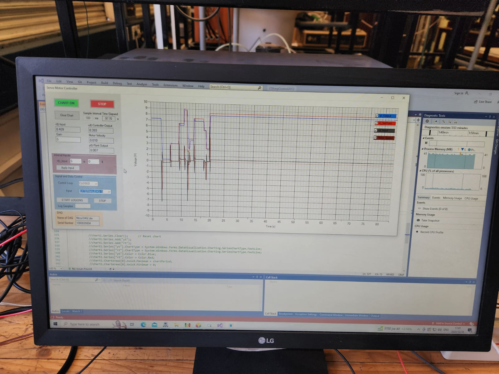
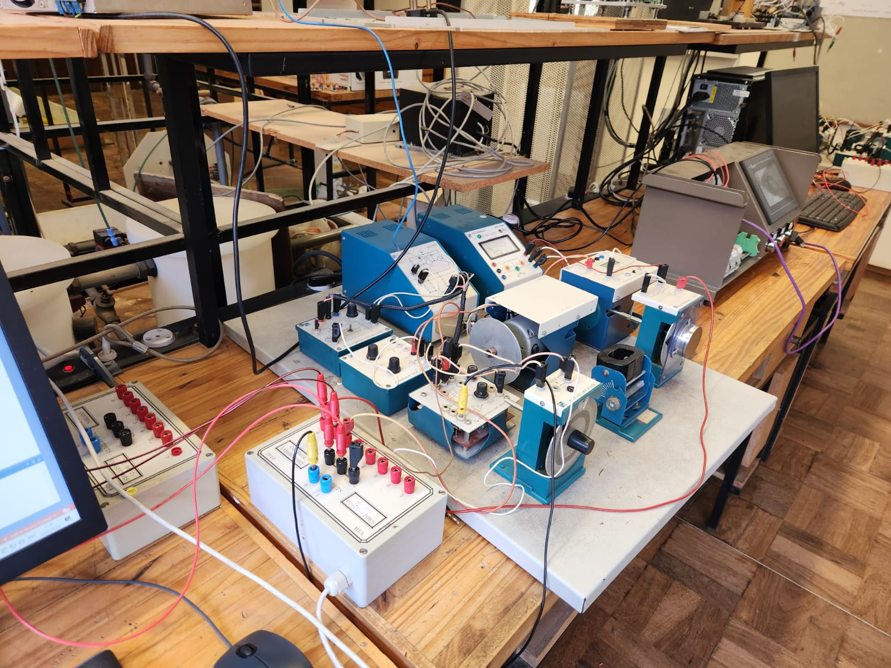
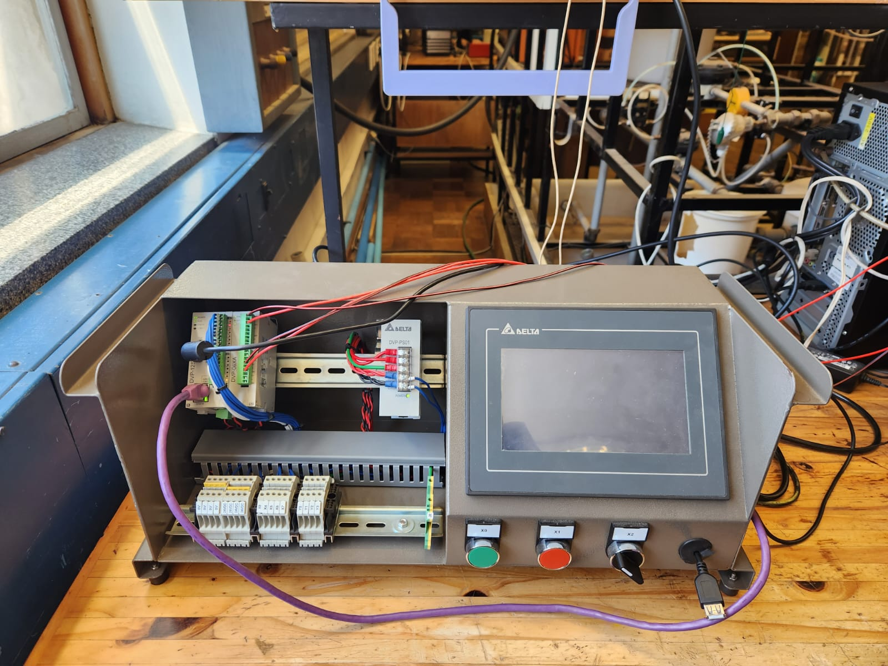
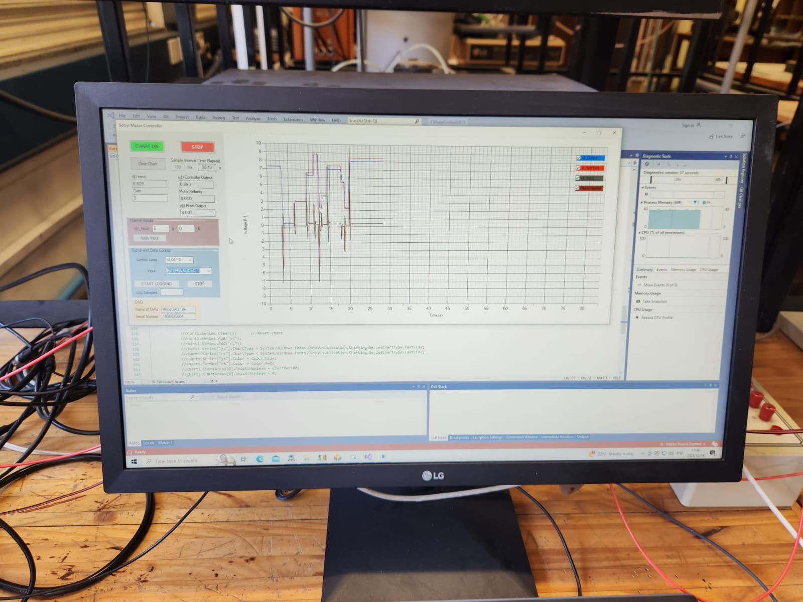

# UCT Controls System Vacation Work 
 

This repository contains my work during my time at the Controls Lab at the University of Cape Town (UCT). The focus of this project was on reconfiguring and repairing Delta Programmable Logic Controllers (PLCs) while getting exposed to ISPSoft and DOPSoft. Below is a brief overview of the tasks and tools involved:

## Overview
- **Wiring & Setup:** I wired and configured the controllers to ensure correct operation in the lab.
- **Controller Tuning:** I designed and programmed a C# application to visually assess the controller's performance and set them to track with minimal error.
- **Delta PLC & HMI:** I worked with a Delta PLC integrated with a Human Machine Interface (HMI) touch screen for improved usability and control.
- **Software Exposure:** 
  - ISPSoft for PLC programming.
  - DOPSoft for HMI development.
- **Outreach Presentation:** I presented the lab work and its real-world applications to a group of Grade 12 learners as part of an educational outreach initiative.

## How to Navigate this Repository
- **Code & Configuration:** The source code for the C# application and PLC configurations can be found in the folders.
- **Documentation:** Detailed steps on wiring, controller setup, and PLC programming are documented in the `EEE3000X` folder, Delta_PLC_Practical Manual_Nico_Josh_Luke_Sthabiso.

## Visuals
    

Feel free to explore the repository to learn more about the work and setup!
